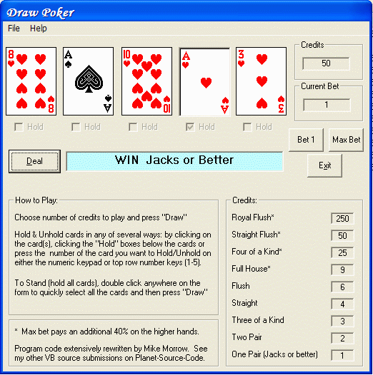



## Easy and Fast Draw Poker

### Description

Play Draw Poker. Built on a base by noi_max, heavily modified in all operational aspects. This update puts in a pre-dealer which selects 10 cards and uses them to deal no matter when you hit Deal the second time. I had a totally random dealer which would deal different cards depending on when you hit deal. Look for how you can preview the second 5 cards (pronounced cheat).
 
### More Info
 
This card game has source cards included. No DLL needed.

             |
---                |---
**Submitted On**   |2005-05-13 22:24:16
**By**             |[Mike Morrow](https://github.com/Planet-Source-Code/PSCIndex/blob/master/ByAuthor/mike-morrow.md)
**Level**          |Intermediate
**User Rating**    |5.0 (20 globes from 4 users)
**Compatibility**  |VB 6\.0
**Category**       |[Complete Applications](https://github.com/Planet-Source-Code/PSCIndex/blob/master/ByCategory/complete-applications__1-27.md)
**World**          |[Visual Basic](https://github.com/Planet-Source-Code/PSCIndex/blob/master/ByWorld/visual-basic.md)
**Archive File**   |[Easy\_and\_F1888185142005\.zip](https://github.com/Planet-Source-Code/mike-morrow-easy-and-fast-draw-poker__1-60163/archive/master.zip)

